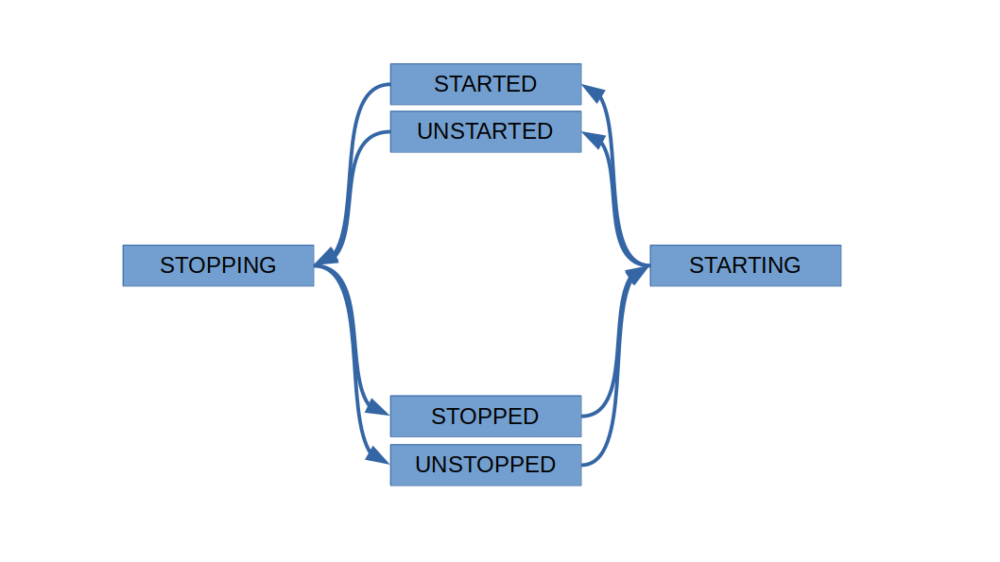

# Startable

Startable 是一个 JavaScript 的后台对象框架。初衷是为了适配阿里开源 Node.js 进程管理器 [Pandora](https://github.com/midwayjs/pandora)。

## 什么是后台对象

一个 [Buffer](https://nodejs.org/dist/latest-v14.x/docs/api/buffer.html#buffer_class_buffer)，你不去访问他，他就一致保持静态什么也不干。当你运行他的方法时，他才活动。这样的响应式的对象就是前台对象。

一个 [TCP Socket](https://nodejs.org/dist/latest-v14.x/docs/api/net.html#net_class_net_socket)，你不去访问他，他也会在后台运行一个服务例程来接收对面发来的数据。这样的对象就是后台对象。

后台对象通常有以下特点

- 后台服务有一个异步的启动和停止过程

    比如一个 TCP Socket 有一个异步的握手和挥手的过程。

- 停止过程可能自发开始

    比如一个 TCP Socket 可能因可能因网络中断而离开了「正常提供服务中」的状态，不得不自发开始停止过程。

- 启停过程本身也可能发生异常而失败

    比如一个 TCP Socket 连接时就没连上。

## Startable 抽象类

将你要定义的后台类继承 Startable，然后将异步的启停过程实现在 `._start()` 和 `._stop()` 中。

```ts
class Daemon extends Startable {
    protected async _start(): Promise<void> {    }
    protected async _stop(): Promise<void> {    }
}

const daemon = new Daemon();
await daemon.start();
await daemon.stop();
```

## 状态循环

一个 Startable 对象的生命周期有 6 个状态，依次循环不可跳跃



1. 一个 Startable 刚 new 出来时是 STOPPED 状态。
1. 此时运行异步的 `.start()` 进入 STARTING 状态，Startable 会调用你实现的 `._start()`。
1. `.start()` 结束时，如果 fulfilled 则进入 STARTED 状态，也就是「正常提供服务中」的状态，如果 rejected 则进入 UNSTARTED 状态。
1. 此时运行异步的 `.stop()` 进入 STOPPING 状态，Startable 会调用你实现的 `._stop()`。
1. `.stop()` 结束时，如果 fulfilled 则进入 STOPPED 状态，如果 rejected 则进入 UNSTOPPED 状态。

你可以通过 `readyState` 属性查看当前时刻的状态。

```ts
console.log(daemon.readyState === ReadyState.STOPPED);
```

## 启停方法

### 启动方法

| 状态 | `.start()` 的行为 | `.start()` 的值 |
|---|---|---|
| STOPPED/UNSTOPPED | 开始启动过程 | 最近一次启动过程的 Promise（即本次 `.start()` 所开始的这次） |
| STARTING | 什么也不干 | 最近一次启动过程的 Promise（即正在进行的这次） |
| STARTED/UNSTARTED | 什么也不干 | 最近一次启动过程的 Promise（即刚刚结束的那次） |
| STOPPING | 什么也不干 | 一个立即 rejected 的 Promise，其携带的异常属于 StartDuringStopping 类 |

- 你可以在启动过程中尽情地重复运行 `.start()` ，而不用担心重复运行你的 `._start()` 实现。
- 在启动过程中无法查看上一次停止是否成功。

### 停止方法

| 状态 | `.stop()` 的行为 | `.stop()` 的值 |
|---|---|---|
| STOPPED/UNSTOPPED | 什么也不干 | 最近一次停止过程的 Promise（即刚刚结束的那次） |
| STARTING | 使正在进行的启动过程最终 rejected | 一个立即 rejected 的 Promise，其携带的异常属于 `StopDuringStarting` 类 |
| STARTED/UNSTARTED | 开始停止过程 | 最近一次停止过程的 Promise（即本次 `.stop()` 所开始的这次） |
| STOPPING | 什么也不干 | 最近一次停止过程的 Promise（即正在进行的这次） |

- 你可以在停止过程中尽情地重复运行 `.stop()` ，而不用担心重复运行你的 `._stop()` 实现。
- 在停止过程中无法查看上一次启动是否成功。
- `.stop()` 返回的 Promise 默认已经添加了一个空的 rejection handler，因此你可以 `this.stop()` 而不必 `this.stop().catch(() => {})`，不用担心停止过程本身的 rejection 抛到全局空间中去触发 `unhandledRejection`。
- `.stop()` 默认已经绑定到 Startable 上了，因此你可以把 `this.stop` 作为回调而不必 `err => this.stop(err)`。

## 自发启停

一个 Startable 自己可以调用自己的 `.stop()` 和 `.start()`。

当自己发生错误时，就应当调用自己的 `.stop()`，参数填一个 Error 表示原因。因为在语义上，此时自己已经结束了「正常提供服务中」的状态。

```ts
class Daemon extends Startable {
    constructor() {
        super();
        this.someComponent.on('some fatal error', this.stop);
    }
}
```

Startable 允许 `.start()` 接受一个钩子 onStopping 回调，当这个 Startable 的 `.stop()` 运行时会同步地调用这个回调，并将你填进 `.stop()` 的参数传递给这个回调，用于第一时间通知外部。你可以自行定义这个 Error 参数的语义，然后在回调中根据参数判断停止的原因。一般来说，如果是自发停止则传参，如果是从外部被动停止则不传参，这样就可以在回调中根据参数是否存在来判断是不是自发停止。

```ts
// main coroutine

const daemon = new Daemon();
function startDaemon(){
    daemon.start(err => {
        if (err) handleRunningException(err);
        daemon.stop().catch(handleStoppingException);
    }).catch(handleStartingException);
}
function stopDaemon() {
    daemon.stop(); // have a think about why .catch() is not necessary.
}
```

## 丑陋的写法

```ts
class Daemon extends Startable {
    constructor() {
        super();
        this.someComponent.on('some fatal error', err => {
            handleRunningException(err); // don't do this.
            this.stop();
        });
    }
}

const daemon = new Daemon();
function startDaemon() {
    daemon.start(() => {
        daemon.stop().catch(handleStoppingException)
    }).catch(handleStartingException);
}
function stopDaemon() {
    daemon.stop();
}
```

这个例子的问题在于，一个后台对象中出现的一个让你不得不自发停止的致命错误，那么对这个异常的 handle 代码不应写在类定义的里面，因为这个 handle 过程在语义上不属于这个对象的一部分。

---

```ts
class Daemon extends Startable {
    constructor() {
        super();
        this.someComponent.on('some fatal error', err => {
            this.stop(err)
                .catch(handleStoppingException); // don't do this.
        });
    }
}

const daemon = new Daemon();
function startDaemon() {
    daemon.start(err => {
        if (err) handleRunningException(err);
    }).catch(handleStartingException);
}
function stopDaemon() {
    daemon.stop().catch(handleStoppingException);
}
```

这个例子的问题在于，一个后台对象的自发停止过程发生异常而失败，这个异常的 handle 代码不应写在类定义的里面，因为对停止失败的 handle 过程在语义上不属于这个对象的一部分，哪怕是这次停止是自发的。

## 依赖

### 内部依赖

如果一个 Startable 依赖于其内部的其他 Startable，即

- 当所有儿子的 `.start()` 都 fulfilled 后，爸爸的 `.start()` 才能 fulfilled。因为在语义上，只有当所有儿子都进入「正常提供服务中」的状态时，爸爸才算进入「正常提供服务中」的状态。
- 只要有一个儿子自发开始停止过程，即这个儿子运行了他自己的 `.stop()`，那么爸爸也必须立即开始停止过程。因为在语义上，只要有一个儿子离开了「正常提供服务中」的状态，爸爸就算不上「正常提供服务中」的状态了。

```ts
class Parent extends Startable {
    private child1: Startable;
    private child2: Startable;

    protected async _start(): Promise<void> {
        await child1.start(this.stop);
        await child2.start(this.stop);
    }
    protected async _stop(): Promise<void> {
        await child2.stop();
        await child1.stop();
    }
}
```

- 如果在 child2 启动过程中，已经启动完成的 child1 开始自发停止，那么 child1 会通过 onStopping 回调调用 parent 的 `.stop()`，此时 parent 处于 STARTING 状态，导致 parent 的启动过程 rejected。在语义上，一个后台对象启动过程中，他依赖的儿子挂了，这个后台对象的启动过程也确实算不上成功，因此语义与实现是一致的。
- 如果调用 `parent.stop()`，`parent.stop()` 会调用 `child.stop()`，`child.stop()` 会通过 onStopping 回调再次调用 `parent.stop()`，不过此时 parent 处于 STOPPING 状态，parent 内部的 `._stop()` 实现不会被调用两次。

### 外部依赖

一个 Startable 的依赖也可能是外部的 Startable。将所有所依赖的外部 Startable 放在上下文对象中，每个 Startable 的 `.start()` 在上下文中取出自己的依赖，等待依赖完成启动。

```diff
    class Daemon extends Startable {
        constructor(private ctx: {
            dep: Startable;
        }) { super(); }

        protected async _start() {
-           assert(
-               this.ctx.dep.readyState === ReadyState.STARTING ||
-               this.ctx.dep.readyState === ReadyState.STARTED
-           );
-           await this.ctx.dep.start(this.stop);
+           await this.ctx.dep.assart(this.stop);
        }
    }
```

`assart()` 是一个等效的快捷方式，意思是 assert + start。

## 可复用性

如果想要让 Startable 可复用的话，`._stop()` 的语义必须很严格：`._stop()` 返回时对这个后台对象的停止工作已完全结束，可以立即开始新一轮启动。

如果 Startable 不需要复用的话，`._stop()` 的语义可以比较宽松：`._stop()` 返回时停止工作已经结束，但还没有为新一轮启动做好准备，比如内部某协程还差几个无关紧要事件循环没有跑完。

## 协程安全

写多线程要考虑线程同步问题，一个线程内的连续代码并不一定在连续时间片中运行，他们之间可能插入了其他时间片跑着其他线程的代码。同理，写多协程也要考虑协程同步问题，一个协程内的 await 两侧的连续代码并不一定在连续的事件循环中运行，他们之间可能插入了其他事件循环跑着其他协程的代码。

Startable 用 Promise 搞来搞去，必然存在协程同步问题。例如如果一个 Startable 被多个协程控制，那么在任意一个协程内

```ts
await daemon.start();
console.log(daemon.readyState);
```

的结果不一定是 STARTED，完全有可能是 STOPPING 或 STOPPED。而 Startable 的状态是成环的，搞不好甚至已经转了一圈到了下一次 STARTING 了。

## 浏览器兼容性

Startable 继承于 `node:events` 的 polyfill [events](https://github.com/browserify/events)，与 node 核心模块同名。在 node 中会自动加载核心 events 模块，在浏览器中会自动加载 polyfill。
