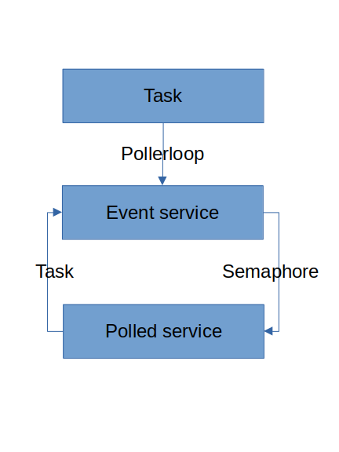

# Startable

Startable 是一个 JavaScript 的 Daemon 生命周期管理器。初衷是为了适配阿里开源 Node.js 进程管理器 [Pandora](https://github.com/midwayjs/pandora)。

[API](./docs/index.html)

## 服务

- 任务
- 服务
	- 事件触发式

		服务占有线程，用户被调用。俗称 Daemon。

	- 轮询式

		用户占有线程，服务被调用。俗称资源。

		新开一个线程写个循环转换为事件触发式。

		- 阻塞式读写单条消息（使用 libev 转换为回调式）
		- 回调式读写单条消息

C 语言中一个文件描述符就是一个轮询式服务，向用户提供文件访问服务。他本身不占用线程，如果某时刻底层资源挂了，只要不去读这个文件描述符，用户态就永远不知道底层资源挂了。

绝大多数消息传递过程，消息汇的性能都远大于消息源。所以事件触发式消息汇很少见，否则消息源会不停地收到「需要消息」的事件。

Nodejs 中一个 TCP 连接，就是一个事件触发式服务。他本身占用协程，如果底层连接断了，会触发事件。

JavaScript 协程是协作式调度，与抢占式调度相比的优势在于状态切换的过程具有天然事务性。抢占式切换状态需要给状态加锁。

C 语言打开一个文件的过程由内核确保事务性，打开失败等于梅开。而用户态服务的启动过程如果失败了，内部组件可能开了一半，处于不一致状态，因此打开失败后也必须关闭。



### Resource

资源有以下特点

- 有一个异步的启动和停止过程

	比如一个 TCP Socket 有一个异步的握手和挥手的过程。

- 启停过程本身也可能发生异常而失败

	比如一个 TCP Socket 连接时就没连上。

### Daemon

Daemon 比资源多出以下特点

- 停止过程可能自发开始

	比如一个 TCP Socket 可能因可能因网络中断而离开了「正常提供服务中」的状态，不得不自发开始停止过程。

写 Daemon 的麻烦之处在于，底层资源可能在 Daemon 生命周期的任何阶段挂掉，可能在启动停止过程中挂掉。

Startable 是 JavaScript 的 Daemon 生命周期管理器，有了他你就可以把心思花在业务逻辑上。

当然 Startable 也可以管理资源，毕竟资源可以被看成永不自发停止的 Daemon。

## Best practices

当自己发生内部错误时，就应当调用自己的 `.stop()`，因为在语义上，此时自己已经结束了「正常提供服务中」的状态。

```ts
class Daemon implements DaemonLike {
	public $s = createStartable(
		this.rawStart.bind(this),
		this.rawStop.bind(this),
	);

	public constructor() {
		this.someComponent.on('some fatal error', this.$s.stop);
	}
}
```

`.start()` 可以接受一个 onStopping 钩子作为回调，用于在停止过程开始时通知外部。当停止过程开始时会先同步地调用这个回调，并将你填进 `.stop()` 的参数传递给这个回调。你可以自行定义这个 Error 参数的语义，然后在回调中根据参数判断停止的原因。

如果是自发停止则传参，如果是从外部被动停止则不传参，这样就可以在回调中根据参数是否存在来判断是不是自发停止。

```ts
// main coroutine

const daemon = new Daemon();
function startDaemon(){
	daemon.$s.start(err => {
		if (err) handleRunningException(err);
		daemon.$s.stop().catch(handleStoppingException);
	}).catch(handleStartingException);
}
function stopDaemon() {
	daemon.$s.stop();
}
```

### Composition

如果一个 Startable 依赖于其内部的其他 Startable，即

- 当所有儿子的 `.start()` 都 fulfilled 后，爸爸的 `.start()` 才能 fulfilled。因为在语义上，只有当所有儿子都进入「正常提供服务中」的状态时，爸爸才算进入「正常提供服务中」的状态。
- 只要有一个儿子自发开始停止过程，即这个儿子运行了他自己的 `.stop()`，那么爸爸也必须立即开始停止过程。因为在语义上，只要有一个儿子离开了「正常提供服务中」的状态，爸爸就算不上「正常提供服务中」的状态了。

```ts
class Parent implements DaemonLike {
	private child1: Daemon;
	private child2: Daemon;

	protected async rawStart(): Promise<void> {
		await child1.$s.start(this.$s.stop);
		await child2.$s.start(this.$s.stop);
	}
	protected async rawStop(): Promise<void> {
		await child2.$s.stop();
		await child1.$s.stop();
	}
}
```

- 如果在 child2 启动过程中，已经启动完成的 child1 开始自发停止，那么 child1 会通过 onStopping 回调调用 parent 的 `.stop()`，此时 parent 处于 STARTING 状态，导致 parent 的启动过程 rejected。在语义上，一个 Daemon 启动过程中，他依赖的儿子挂了，这个 Daemon 的启动过程也确实算不上成功，因此语义与实现是一致的。
- 如果调用 `parent.stop()`，`parent.stop()` 会调用 `child.stop()`，`child.stop()` 会通过 onStopping 回调再次调用 `parent.stop()`，不过此时 parent 处于 STOPPING 状态，parent 内部的 `.rawStop` 实现不会被调用两次。

### Aggregation

一个 Startable 的依赖也可能是外部注入的 Startable。

```ts
class Daemon implements DaemonLike {
	public constructor(
		dep: Startable,
	) { }

	protected async rawStart() {
		await this.dep.$s.start(this.stop);
	}
}
```

## Bad practices

```ts
class Daemon {
	public constructor() {
		this.someComponent.on('some fatal error', err => {
			handleRunningException(err); // don't do this.
			this.$s.stop();
		});
	}
}

const daemon = new Daemon();
function startDaemon() {
	daemon.$s.start(() => {
		daemon.$s.stop().catch(handleStoppingException)
	}).catch(handleStartingException);
}
function stopDaemon() {
	daemon.$s.stop();
}
```

这个例子的问题在于，一个 Daemon 中出现的一个让你不得不自发停止的致命错误，那么对这个异常的 handle 代码不应写在类定义的里面，因为这个 handle 过程在语义上不属于这个对象的职责，不是你的职责却非要越俎代庖，违反了迪米特法则。

---

```ts
class Daemon implements DaemonLike {
	public constructor() {
		this.someComponent.on('some fatal error', err => {
			this.$s.stop(err)
				.catch(handleStoppingException); // don't do this.
		});
	}
}

const daemon = new Daemon();
function startDaemon() {
	daemon.$s.start(err => {
		if (err) handleRunningException(err);
	}).catch(handleStartingException);
}
function stopDaemon() {
	daemon.$s.stop().catch(handleStoppingException); // don't do this.
}
```

这个例子的问题在于，一个 Daemon 的自发停止过程发生异常而失败，这个异常的 handle 代码不应写在 `.stop()` 的 caller 中，因为 caller 有很多个，不得不写很多遍。

## 协程安全

写多线程要考虑线程同步问题，一个线程内的连续代码并不一定在连续时间片中运行，他们之间可能插入了其他时间片跑着其他线程的代码。同理，写多协程也要考虑协程同步问题，一个协程内的 await 两侧的连续代码并不一定在连续的事件循环中运行，他们之间可能插入了其他事件循环跑着其他协程的代码。

Startable 用 Promise 搞来搞去，必然存在协程同步问题。例如如果一个 Startable 被多个协程控制，那么在任意一个协程内

```ts
await daemon.start();
console.log(daemon.getReadyState());
```

的结果不一定是 STARTED，完全有可能是 STOPPING 或 STOPPED。

## 健壮性

```ts
class Daemon implements DaemonLike {
	private child: DaemonLike;

	private async rawStart() {
		await child.$s.start(this.$s.stop);
		await somePromise;
		child.someMethod(); // child may be STOPPING.
	}
}
```

因此 Daemon 的所有公共方法务必确保健壮性，要么返回正确结果，要么抛出，不能导致不一致的不可预料结果。

所有 async 公共方法，如果过程中进入 STOPPING，同样要么返回正确结果，要么抛出。
